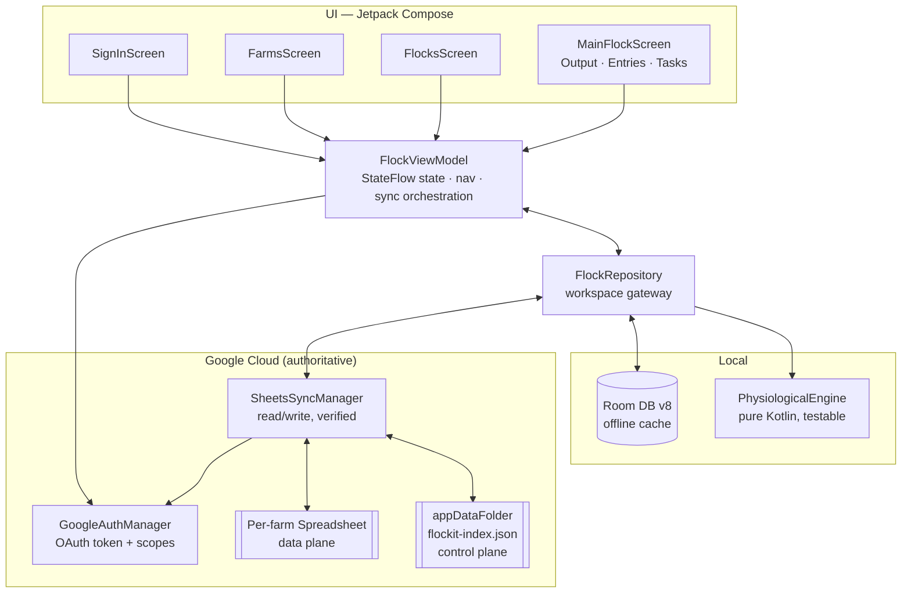
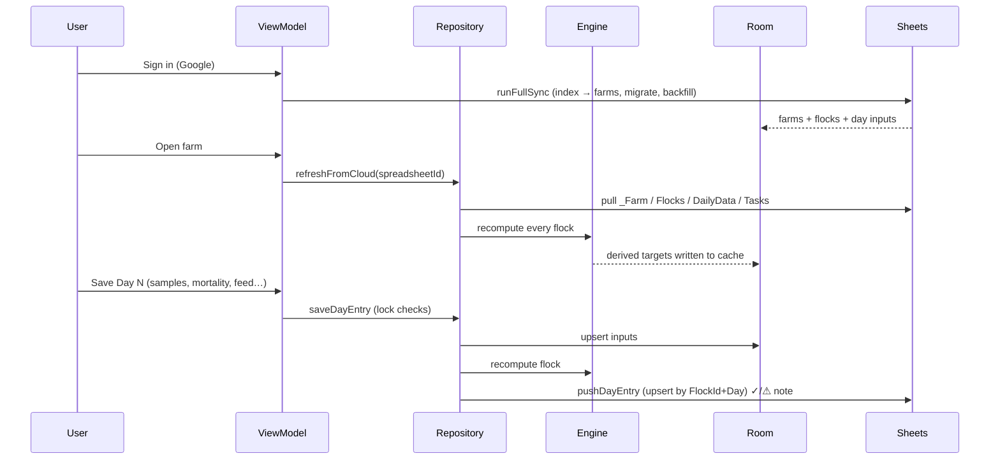
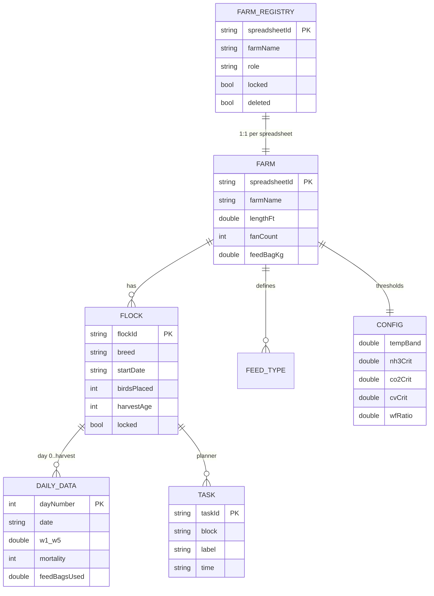
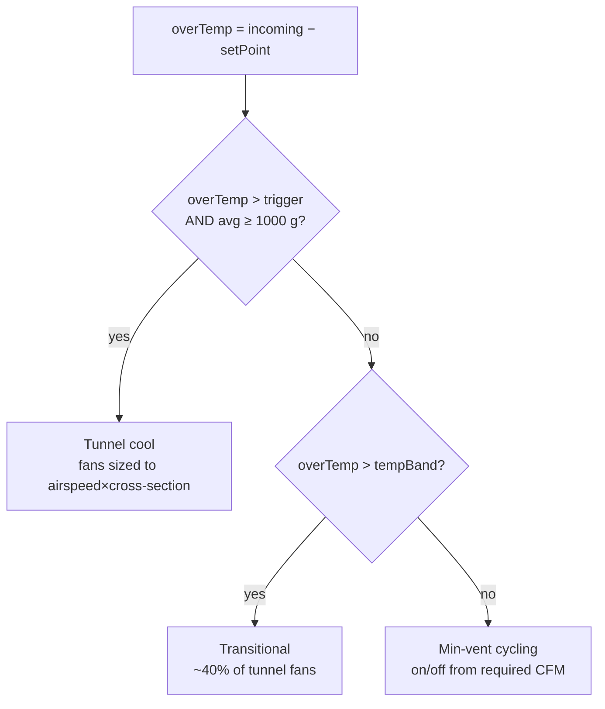

# FlockIt — Broiler Farm Management, on Google Sheets

FlockIt is a native **Android** app (Kotlin + Jetpack Compose) for managing broiler
poultry grow-out. Its guiding idea:

> **Google Sheets is the backend.** The app is a smart UI/overlay on top of a Google
> Spreadsheet per farm. Sheets + Drive give us storage, multi-user sharing and live
> collaboration for free; the app adds the things Sheets can't do on its own —
> day-locking, a physiological targets engine, offline entry, a recycle bin, and a
> fast cross-device account.

- **Package:** `com.ashfaque.flockit`  ·  **min SDK** 24 · **target/compile SDK** 36
- **Stack:** Kotlin 2.2, Jetpack Compose (Material 3), Room, Retrofit/Moshi, Coroutines/Flow, MVVM
- **Branches:** `main` (this working build) · `claude-app` (active development)

---

## Table of contents
1. [What the app does](#1-what-the-app-does)
2. [Architecture](#2-architecture)
3. [The two-plane sync model](#3-the-two-plane-sync-model)
4. [User & data flow](#4-user--data-flow)
5. [Data model](#5-data-model)
6. [Google Sheet layout (the backend)](#6-google-sheet-layout-the-backend)
7. [The physiological engine — formulas & methods](#7-the-physiological-engine--formulas--methods)
8. [Parameters reference](#8-parameters-reference)
9. [Read/write handling & conflict rules](#9-readwrite-handling--conflict-rules)
10. [Source map](#10-source-map)
11. [Build & run](#11-build--run)
12. [Google OAuth setup](#12-google-oauth-setup)
13. [Testing reality & roadmap](#13-testing-reality--roadmap)

---

## 1. What the app does

A three-level hierarchy: **Farms → Flocks → Flock dashboard**.

- **Sign in** with Google (real cloud) or use **Offline mode** (local only).
- **Farms** — create a farm (which creates its own spreadsheet in your Drive), open,
  share, lock, or delete (via a ⋮ menu → recycle bin).
- **Flocks** — each farm holds one or more flocks (batches / houses). A flock has a
  breed, placement count, transit mortality, start date/time and harvest age.
- **Flock dashboard** — per-day:
  - **Output / gist** — "today at a glance", ideal-vs-actual targets, feed plan
    (required bags vs consumed vs on-hand), live-bird balance, air-quality readings,
    an animated fan and a brooding floor-plan.
  - **Entries** — the day's raw inputs: 5-point weight samples, mortality, feed used,
    deliveries, measured climate/water readings.
  - **Tasks** — colour-coded Morning / Evening / Night task planner.
- Scrub across days (past → today → **projected future days**) with a slider.

Every parameter is shown as **ideal (breed standard) vs current (your reading)** with
min/max tolerance, and the plan (**ideal / required**) is kept distinct from the actual
(**consumed / measured**).

---

## 2. Architecture

Classic MVVM with a repository that doubles as the **cloud workspace gateway**. Room is
an offline cache/mirror; **Google Sheets is the source of truth**.



**Layer responsibilities**

| Layer | File(s) | Responsibility |
|---|---|---|
| UI | `ui/screens/*`, `ui/components/*` | Stateless Compose screens; render `StateFlow`, emit intents |
| ViewModel | `ui/FlockViewModel.kt` | Holds UI state, navigation, sign-in, orchestrates sync |
| Repository | `data/FlockRepository.kt` | Single gateway: writes to Room **and** pushes to Sheets (verified), pulls + recomputes, recycle bin |
| Engine | `engine/PhysiologicalEngine.kt` | Pure math: weight-age, feed, water, ventilation, density, targets |
| Cloud | `sync/*` | Auth/scopes, Sheets + Drive REST, the appDataFolder index |
| Persistence | `data/*` (Room) | Local mirror for offline + instant UI |

---

## 3. The two-plane sync model

The hard problem is *"log into a new device and my farms (owned **and** shared) load
fast and correctly."* Google's Drive `drive.file` scope **cannot see files merely shared
with you, or files created on another device**, so discovery by `files.list` fails on a
second device. FlockIt solves this by splitting cloud state into two planes:

### Control plane — `flockit-index.json` in the appDataFolder
A hidden, **per-user, per-app** file in Drive's `appDataFolder` that **syncs across all
the user's devices**. It is the source of truth for *which farms this user has*:

```json
{ "version": 1,
  "farms": [
    { "spreadsheetId": "1AbC…", "name": "Maa Tarini", "role": "owner",  "deleted": false },
    { "spreadsheetId": "1XyZ…", "name": "Partner Farm", "role": "editor", "deleted": false }
  ] }
```

Login on any device → read the index → the Farms list appears instantly. Creating a
farm, accepting a shared farm, or deleting one updates the index.

### Data plane — one spreadsheet per farm
Each farm is a single Google Spreadsheet read/written via the **`spreadsheets`** scope,
which works for **owned and shared** sheets alike — that's what enables live
collaboration. Sharing a farm = a Drive `permissions.create(email, role)` (plus a
copy-link).

### Scopes
| Scope | Why |
|---|---|
| `…/auth/spreadsheets` | Read/write any accessible sheet incl. shared (data plane) |
| `…/auth/drive.file` | Create & share the app's own farm spreadsheets |
| `…/auth/drive.appdata` | Hidden per-user index that syncs across devices (control plane) |

---

## 4. User & data flow



**Verification is visible:** every cloud write reports back in-app —
`✓ … synced to Google Sheet` or `⚠ … saved locally but not synced: <reason>` — so a
failing write is never silent (see [§9](#9-readwrite-handling--conflict-rules)).

---

## 5. Data model

Room entities (`data/Entities.kt`). Everything is keyed by `spreadsheetId` (the farm).



- **FarmRegistryEntity** — one row per farm the device knows (name, role, lock, soft-delete).
- **FarmEntity** — the physical farm/house: dimensions, fans, heaters, pads, drinker &
  feeder lines, feed bag size, weather location, cut-off time.
- **ConfigEntity** — tunable thresholds & engine constants (see [§8](#8-parameters-reference)).
- **FeedTypeEntity** — B1/B2/B3… feed phases (default 60 kg/bag).
- **FlockEntity** — a batch: breed, start date/time, birds placed, transit mortality,
  target weight, harvest age, lock/soft-delete.
- **DailyDataEntity** — one row per day (0…harvest). Stores the day's **inputs** plus a
  cache of **engine-computed** values.
- **TaskEntity** — planner items bucketed into Morning/Evening/Night blocks.

---

## 6. Google Sheet layout (the backend)

Creating a farm builds a spreadsheet titled `FlockIt - <name>` inside a **"FlockIt Farms"**
Drive folder, with these tabs:

| Tab | Purpose |
|---|---|
| `_Meta` | App marker (`app=FlockIt`, `schemaVersion`, `createdAt`) — used to validate a sheet |
| `_Farm` | Farm settings as key/value |
| `_Config` | Threshold/engine config as key/value |
| `_FeedTypes` | Feed phases (code, name, bagKg, phase, sortOrder) |
| `Flocks` | One row per flock (full definition) |
| `DailyData` | **Authoritative daily INPUTS**, one row per (FlockId, Day) |
| `Tasks` | Planner rows |
| `ActivityLog` | Append-only audit trail (who did what, when) — the "commits" |

**Design decisions that make read/write robust** (`sync/SheetsSyncManager.kt`):

- **`DailyData` stores INPUTS only** (47-column schema `DAILY_HEADERS`). Every derived
  value (targets, FCR, ventilation, area…) is **recomputed on each device** by the
  engine — so there is nothing to conflict over, the sheet stays small, and it's still
  human-readable.
- **One canonical column order per tab**, shared by the writer and reader → no drift.
- **Writes are anchored at a single top-left cell** (`'Tab'!A1`) so an atomic
  `batchUpdate` can never `400` on a range/width mismatch; underscore tabs are quoted.
- **`valueInputOption = RAW`, every cell a String** → what we write is exactly what we
  read back (no locale/number/date/scientific surprises).
- **Every write checks `res.isSuccessful`** and returns a `Result`; failures surface to
  the user. *(This class of bug — an atomic populate silently failing on a bad range,
  leaving the sheet empty — was the original "nothing syncs" defect; it's now fixed and
  guarded.)*

---

## 7. The physiological engine — formulas & methods

`engine/PhysiologicalEngine.kt` is pure, UI-free Kotlin (unit-testable). Core premise:

> **Calendar age ≠ physiological weight-age.** A sampled body weight is mapped back onto
> the breed growth curve to get a fractional **weight-age**, and *that* drives temperature,
> feed, water, ventilation and density targets.

### Breed standards & curves
- `STANDARDS` — Ross 308 (AP 2022, as-hatched) and Cobb 500 day 0–49: body weight,
  daily feed, cumulative feed and standard FCR.
- Age/BW lookup curves: `CURVE_TEMP_BY_BW`, `CURVE_MINVENT_BY_AGE`, `CURVE_RH_BY_AGE`,
  `CURVE_AIRSPEED_BY_AGE`, `CURVE_LIGHT_BY_AGE`, `CURVE_MAXMORT_BY_AGE`,
  `CURVE_WATERLINE_BY_AGE`, `CURVE_DRINKERHT_BY_AGE`.
- `interpolate(table, x)` — piecewise-linear, clamped at both ends. Underlies every
  `…FromDay` / `…FromBW` lookup.

### Key formulas

| Quantity | Method | Formula |
|---|---|---|
| Body weight (std) | `bwFromDay(day, breed)` | interpolate breed BW curve |
| **Weight-age** | `weightAgeFromBW(bw, breed)` | inverse of the BW curve (fractional days) |
| Sample average & CV% | `computeWeightSamples()` | avg = Σweight / Σcount; CV = SD(location means)/mean × 100 |
| Feed heat de-rate | `computeFeedHeatDerate(T)` | `clamp(1 − 0.012·(T−20), 0.75, 1.15)` |
| Water heat uplift | `computeWaterUplift(T)` | `1 + 0.06·max(0, T−20)` |
| Daily feed / bird | — | `dailyFeedFromDay(weightAge)·heatDerate` (feed age clamped ≥1) |
| Total feed / bags | — | `feedPerBird·live/1000` kg; bags = `ceil(totalKg / bagKg)` |
| Water / bird (mL) | — | `feedPerBird · wfRatio · waterUplift` (default wfRatio 1.8) |
| **FCR** | — | `cumFeedKg / (live · avgKg)` |
| **cFCR → 2 kg** | `computeCorrectedFcr()` | `(2 − avgKg)·0.25 + FCR` |
| Set-point temp | — | `interpolate(CURVE_TEMP_BY_BW, bw)` (heavier → cooler) |
| Wet-bulb (opt.) | `wetBulb(T, RH)` | Stull (2011) approximation |
| Live birds | — | `placed − transit − Σmortality − Σlifted − Σlame` |
| Density | `computeAreaAndDensity()` | `kg/m² = live·avgKg / usableM²`; barricade & ft²/bird from brood density + cap |
| Ventilation plan | `computeVentPlan()` | min-vent CFM vs tunnel CFM → Min-vent / Transitional / Tunnel; fans + on/off cycle |
| Targets table | `buildTargetComparisons()` | assembles ideal-vs-ground rows per group with good/warn/crit status |

### Ventilation decision (simplified)


`trigger` = 3.0 °C for birds ≥ 1.5 kg else 4.5 °C. Delivered CFM/bird accounts for the
fan duty cycle and de-rate.

---

## 8. Parameters reference

### Farm settings (`FarmEntity`, editable in Farm Settings)
Placement L×W×H, usable L×W, brood density; **fans** (count, rated CFM, de-rate);
**heaters** (count, kW); **pads** (count, area, efficiency); **drinker lines** (count,
tank L, fill min, nipple-line hold L); **feeder lines** (count, bags/line, move-min,
pans/line); **feed** bag kg + feedings/day distribution; diesel-can litres; weather
lat/lon/name & season; density cap; daily cut-off time.

### Config thresholds (`ConfigEntity`)
`tempBand` ±1.5 °C · RH 50–70% · NH₃ warn/crit 10/20 ppm · CO₂ warn/crit 3000/3500 ·
CV warn/crit 10/12% · `wfRatio` 1.8 · `feedHeatK` 0.012 · `waterHeatK` 0.06 ·
`cFcrDivisor` 0.25 · vent cycle 300 s / min-on 30 s · tunnel triggers 4.5 (young)/3.0 (big).

### Daily inputs (`DailyDataEntity`, entered by the farmer)
5-point weight samples (weight g + count each), mortality, feed bags used + type, birds
lifted, weight lifted, lame separated, feed deliveries (3 slots), brooding length, actual
fans + fan-time, outside temp/RH, notes, and **measured readings** the app can't compute:
water temp/pH, feed moisture, measured CO₂/NH₃/O₂/pressure/airspeed, pad wet/dry minutes,
lux, diesel cans used.

### Computed outputs (engine → cached in `DailyData` + shown in UI)
Avg weight, CV%, weight-age, ideal weight, live birds, cum mortality (& %), livability,
density kg/m², set temp, feed/bird, total feed kg, feed bags, water/bird, total water L,
tank refills, CFM/bird, fans to run, fan on/off, vent mode, FCR, cFCR, projected flag,
temp/RH min-ideal-max, CO₂/NH₃ max, airspeed, wind-chill, light hours, max-mort ceiling,
occupied ft², barricade ft, ft²/bird, stock-on-hand, alert level/text, daily gain,
drinker pressure/flow, water low/high (±3 °C sensitivity).

---

## 9. Read/write handling & conflict rules

- **Offline-first:** every mutation writes to Room immediately (instant UI, works
  offline). When signed in, the repository then pushes to the sheet via a **verified**
  `cloudPush` that records a user-visible note.
- **Push points:** `createFlock` (flock row + day rows), `saveDayEntry` (upsert one day),
  `addTask`, `updateFarm` (rewrite `_Farm`). Creating a farm populates all tabs.
- **Pull points:** `refreshFromCloud` on farm open and `runFullSync` on login pull
  `_Farm` / `Flocks` / `DailyData` / `Tasks`, then **recompute every flock** locally.
- **Conflict rule:** **last-write-wins per day-row by `UpdatedAt`** — a pull won't
  clobber a newer un-synced local edit.
- **Locking:** past days and post-cutoff today are read-only for "hard" fields; flocks
  and farms can be locked (read-only) from the ⋮ menu.
- **Audit:** every create/share/update appends to `ActivityLog` (the change history).
- **Offline / demo mode:** cloud pushes are no-ops that report success; data lives in
  Room only until the user signs in.

---

## 10. Source map

```
app/src/main/java/com/example/
├─ MainActivity.kt                 # FlockAppRoot router, Google sign-in launcher
├─ flock/
│  ├─ data/
│  │  ├─ Entities.kt               # Room entities (Farm, Flock, DailyData, Task, …)
│  │  ├─ Daos.kt                   # DAOs (queries, upserts, soft-delete)
│  │  ├─ FlockDatabase.kt          # Room DB v8 + reference/standards seed
│  │  └─ FlockRepository.kt        # workspace gateway: Room + Sheets + engine
│  ├─ engine/PhysiologicalEngine.kt# all formulas, curves, targets
│  ├─ network/WeatherClient.kt     # weather fetch for temp-driven derates
│  ├─ sync/
│  │  ├─ GoogleAuthManager.kt      # OAuth token (GoogleAuthUtil), scopes, auth state
│  │  ├─ GoogleSheetsModels.kt     # Retrofit/Moshi request/response + index models
│  │  ├─ GoogleSheetsService.kt    # Sheets + Drive REST (values, files, appDataFolder)
│  │  └─ SheetsSyncManager.kt      # create/populate, push/pull, index, share, activity
│  └─ ui/
│     ├─ FlockViewModel.kt         # state, nav, sync orchestration
│     ├─ MainFlockScreen.kt        # flock dashboard host
│     ├─ screens/                  # SignIn, Farms, Flocks, Output, Entries, Tasks, …
│     └─ components/               # Fan, floor-plan, dialogs, pickers, top bar, tiles
└─ ui/theme/                       # Material 3 dark theme
```

---

## 11. Build & run

No Android Studio required — command-line build with JDK 17 + Android cmdline-tools.

```bash
# One-time toolchain (Windows, via scoop): temurin17-jdk, android-clt (SDK 36), gradle
# local.properties must use forward slashes:
#   sdk.dir=C:/Users/<you>/scoop/apps/android-clt/current
```

Build the debug APK (PowerShell). **Use an isolated `GRADLE_USER_HOME`** — sharing scoop's
Gradle home mixes Gradle versions and breaks the Kotlin-DSL settings compile:

```powershell
$env:JAVA_HOME       = "$env:USERPROFILE\scoop\apps\temurin17-jdk\current"
$env:ANDROID_HOME    = "$env:USERPROFILE\scoop\apps\android-clt\current"
$env:PATH            = "$env:JAVA_HOME\bin;$env:PATH"
$env:GRADLE_USER_HOME = "$env:USERPROFILE\.gradle-flockit"
cmd /c ".\gradlew.bat :app:assembleDebug --no-daemon --no-configuration-cache --console=plain"
```

Output: `app/build/outputs/apk/debug/app-debug.apk`. Debug builds are signed with a
**committed keystore** `flockit-debug.jks` (store/key pass `flockit`, alias `flockit`) so
the signing SHA-1 is stable across machines — register it once for Google sign-in.

---

## 12. Google OAuth setup

For real Google sign-in + Sheets sync (a Google Cloud project with an **Android OAuth
client**):

1. **SHA-1:** register the debug keystore's SHA-1 on the Android OAuth client, package
   `com.ashfaque.flockit`. (Mismatch → sign-in **error 10 / DEVELOPER_ERROR**.)
2. **Test user:** add your Google account under the OAuth consent screen's test users.
3. **APIs:** enable **Google Sheets API** and **Google Drive API**.
4. Because the app requests `drive.appdata` (added for the cross-device index), **sign out
   and back in once** so Google re-prompts consent for the new scope.

`spreadsheets` is a sensitive scope — fine while the app is in *Testing*; publishing to the
general public would need Google verification. `drive.file` and `drive.appdata` are
non-sensitive.

---

## 13. Testing reality & roadmap

**Reality:** the cloud paths (sign-in, sharing between two accounts, cross-device login)
can only be verified with **real Google accounts on real devices** — a compile is not a
sync test. Each cloud change needs a real-device check.

**Roadmap (on `claude-app`):**
- Lighting: lux/ft², bulbs + wattage in settings, light on/off schedule by age.
- CV% / population-size-distribution chart.
- QR generate + scan for sharing.
- Modern auth (Credential Manager + AuthorizationClient) to replace the deprecated
  `GoogleSignIn` flow.
- Real-time push (background sync / listener) for closer-to-live collaboration.

---

*FlockIt — turning a shared Google Sheet into a real farm-management system.*
